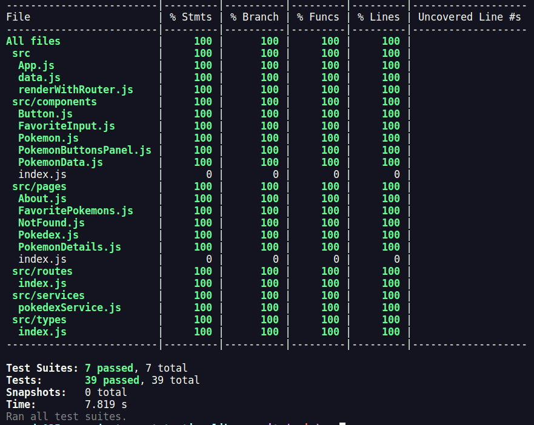

# Project React Testing Library

Esse projeto é um exercício de escrita de testes utilizando Jest e a biblioteca React Testing Library, para uma aplicação React.

A aplicação é uma implementação de uma Pokédex que permite visualizar e filtrar pokemons. O exercício foi escrever testes que garantam o bom funcionamento dessa aplicação. Durante o desenvolvimento da aplicação, eu pude colocar em prática habilidades como:
  * Utilizar os seletores (queries) da React-Testing-Library em testes automatizados;
  * Simular eventos com a React-Testing-Library em testes automatizados;
  * Testar fluxos lógicos assíncronos com a React-Testing-Library;
  * Escrever testes que permitam a refatoração da estrutura dos componentes da aplicação sem necessidade de serem alterados;
  * Testar inputs

Ter uma boa cobertura de testes não significa ter uma aplicação bem testada. Nesse exercício, foi atingida uma cobertura de 100% da aplicação, o que é uma ótima conquista, mas só garante a qualidade da aplicação porque os testes foram escritos integralmente para todas as funcionalidades da aplicação.

<div align="center">
    
</div>

## Como executar

**1. Clone o repositório**

```shell
    git clone git@github.com:CalebeLAR/react-testing-library.git
```

**2. Instale as dependências**

```shell
    npm install
```

**3. Rode a aplicação no navegador**

```shell
    npm start
```

**4. Rode os testes de integração**

```shell
    npm run test
```

para visualizar a cobertura dos testes rode o comando.

```shell
    npm run test-coverage # verifica a cobertura dos testes
```

_Quarto projeto desenvolvido no módulo de Front-End durante minha formação na escola de tecnologia da Trybe, que elaborou os requisitos do projeto e forneceu a aplicação para que fosse testada._
